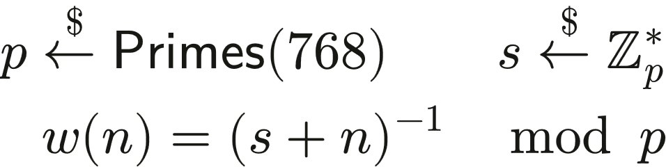
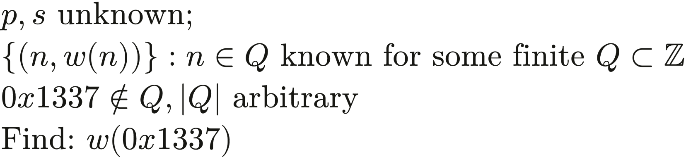
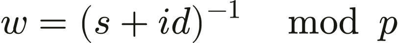
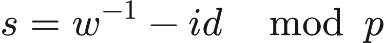
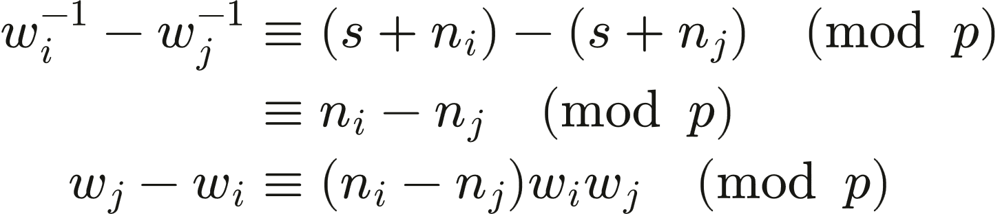
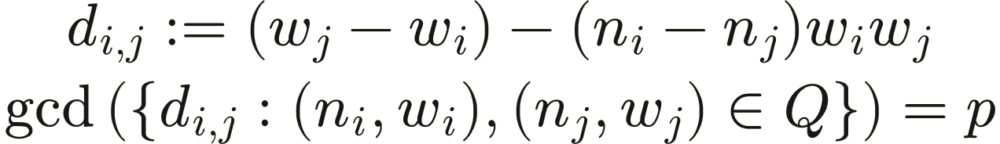

_A completely contrived and useless login service. What more could you ask for from a warmup?_

A cryptography challenge requiring recovery of a secret authentication token by exploiting a reused modulus in modular arithmetic.

## Files

- `server.py` (login service)
- netcat for solve

## The Challenge

The service requires login as admin with ID `0x1337` (decimal 4919). However, registration with this ID is explicitly blocked:

```py
if idv == ADMIN_ID:
    print("error: invalid id")
    return
```

Without a valid registration, there's no obvious way to obtain the token needed to authenticate.

## The Mathematical Setup

The server generates tokens using a secret modulus and value:



For any given ID, the server computes a token by inverting `(s + id)` modulo `p`. Both `p` and `s` remain unknown to an attacker.

## What We Know

The adversary has access to a set of registered IDs and their corresponding tokens:



The admin ID `0x1337` is not in the set `Q`, and we need to find the token for it.

## Initial Approach

The token generation formula is:



Since modular inversion is its own inverse (i.e., `x = (x^{-1})^{-1}`), we can recover the secret by inverting a token:



Testing this approach with a known modulus works perfectly. However, without knowing `p`, we can't invert the token. The challenge is to recover `p` from the available data.

## What I Missed

Initial attempts used the extended Euclidean algorithm to find GCD of multiple tokens, similar to a common modulus attack. However, this approach stalled without a clear next step.

The conceptual approach was close: multiple token-ID pairs from the same secret `s` could theoretically construct equations where `s` cancels out. The missing piece was knowing how to apply congruence algebra to actually make that cancellation happen.

Starting from the token inversion property:



By carefully manipulating these congruences, we can eliminate `s` and express `p` as a common factor across multiple computed values.

For any pair of tokens and IDs, construct:



Taking the GCD of all such pairwise differences yields `p` (or a small multiple of it). Once `p` is recovered, the token for `0x1337` can be computed using the recovery formula.

## Validation

Due to the randomness of `s` and properties of the GCD, recovering `p` may require multiple token-ID pairs. A validation step is necessary: confirm that `p` actually divides the differences before proceeding. If not, more pairs are needed.

Testing with small numbers (8-bit primes) and known `p` and `s` validated that `|Q| = 3` pairs is typically sufficient, though this is not guaranteed.

## Lessons Learned

- **Modular inversion properties:** Understanding that `x^{-1}` is self-inverse under modular arithmetic (i.e., `x = (x^{-1})^{-1} mod p`) is foundational for token recovery.
- **Congruence manipulation:** Algebraic manipulation of modular congruences allows cancellation of unknowns. When multiple equations share the same modulus, differences between them can reveal the modulus itself.
- **Common modulus attacks:** Reusing the same modulus across multiple operations creates exploitable relationships. The GCD of differences between related values often recovers the modulus.
- **Number theoretic approach:** Leaking a cryptographic parameter (the modulus) is possible through careful analysis of pairs of outputs from the same underlying operation.

**Why is the solve written in perl?** inside joke
